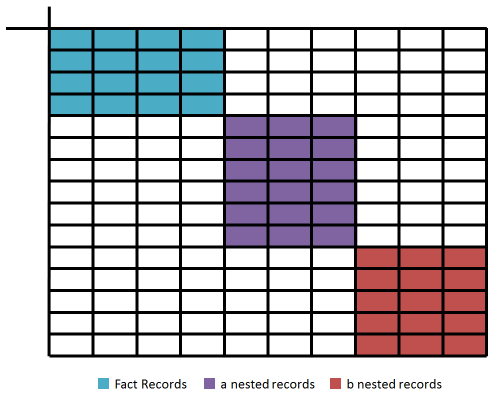
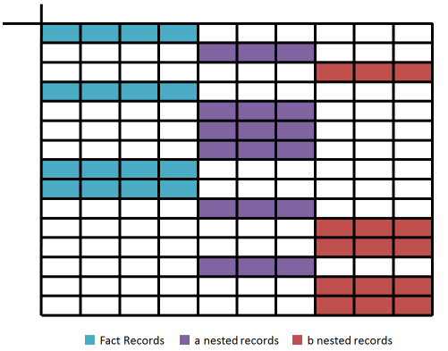
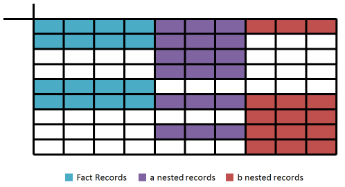
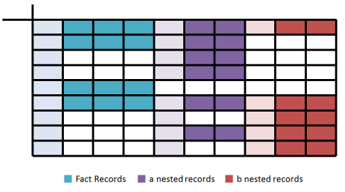
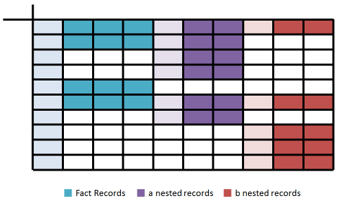

# JSON in a Database

## Constraints

Storing JSON documents as records in a database involves multiple tables when dealing with nested document arrays. The cost of parsing the query, planning the query, and maybe it's network transit time, can be significant; we want to minimize the number of calls to the database.

We want the Python code responsible for performing the final structure construction to be as simple as possible for maximum speed, and easier for PyPy to optimize should we become desperate. The data should already be joined, and in the order we require it.

Therefore we generate SQL code that performs all this for us in a single query

1. Pull all required records from all tables
2. Sort the records so they make constructing structures easy

**Example**

	[
		{"d":11,"e":12,"f":13,"a":{"j":4,"k":5,"b":{"x":6,"y":7}}},
		{
			"d":21,"e":22,"f":23,
			"a":[{"j":4,"k":5},{"j":6,"k":7},{"j":8,"k":9}]
		},
		{"d":31,"e":32,"f":33},
		{
			"d":41,"e":42,"f":43,
			"a":[
				{"j":44,"k":45,"b":[{"x":46,"y":47},{"x":48,"y":49}]},
				{"j":46,"k":47,"b":[{"x":50,"y":51},{"x":52,"y":53}]}
			]
		}
	]

**Table Layout**

<show each table, and full contents>

## Query Tactics

There are a few ways we can return all records in a single query

### Basic 

The most basic strategy is to pull the required records by forming one query for each table, and then `UNION ALL` the result. The queries must respect the output columns; each table is allotted a range of columns to output; the remainder are null. 

The receiver still has work to do; the nested records must be matched to the facts; and facts sorted to form the original JSON. 

### Sorted

We can give the sorting task to the database; we will assume the database is fast, and it simplifies our receiver logic

Now we are able to see the nested structure of each of our documents from simply glancing at the query result

### Sorted and Compressed

We can reduce the number of rows returned by joining the first record of each nested array, and then UNION ALL the remaining nested records.

### Include Metadata

The previous diagrams were all simplifications of what columns really get returned; we only discussed querying the realized properties.  We must also return the metadata, like `__id` and `__parent` which are used to record the database relations between tables and ordering of nested documents. Here is the same query pattern with the metadata highlighted. Notice the metadata for a parent document is included in every row.

### Nested Siblings

The previous examples were of parent-child nesting. Our facts can have more than one nested property. Let `"a"` and `"b"` be sibling properties:

**Example**

	[
		{"d":11,"e":12,"f":13,"a":{"j":4,"k":5},"b":{"x":6,"y":7}},
		{
			"d":21,"e":22,"f":23,
			"a":[{"j":4,"k":5},{"j":6,"k":7},{"j":8,"k":9}]
		},
		{"d":31,"e":32,"f":33},
		{
			"d":41,"e":42,"f":43,
			"a":[{"j":44,"k":45},{"j":46,"k":47}],
			"b":[
				{"x":46,"y":47},
				{"x":48,"y":49},
				{"x":50,"y":51},
				{"x":52,"y":53}
			]
		}
	]

We can see how the query response is structurally different, as it reflects the shape of the JSON.

