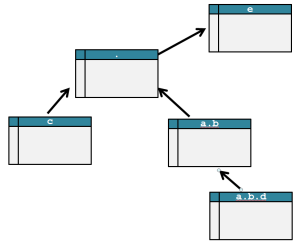
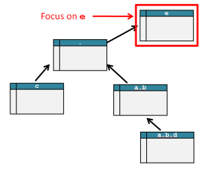
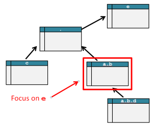
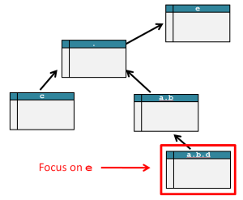

# Column Perspectives in a Snowflake Schema

This document is incomplete, with mistakes.

## Justification

The assumption is we have a primary snowflake schema that covers a relational database. The snowflake concept is an attempt to model the intersection between JSON documents and relational databases. Hopefully, this model will be useful for conceptualizing a document-relational map (DRM) while we program.

## Working example

This JSON document will be used for demonstration throughout.

    {
        "a": {
            "b": [
				{"d": [{"x": 2}]}
			]
        }, 
        "c": {"x": 2},	
        "e": {"x": 3}
    }

And here is the schema it came from:

There are points I should make here.

* The tables are all given relative names: The fact table is named dot (`.`).
* Arrows indicate foreign key relations: The table at the tail of the arrow is assumed to have a property that refers to the table at the head
* The foreign keys are not shown in the document: If the relational database uses foreign keys to only indicate relations, then it is good remove those properties that have no other meaning. Sometimes the foreign key is used for business logic, and must be exposed.
* The arrays in the document have only one object: In the context of JSON Query Expressions we could argue that these arrays are just single documents and no arrays exist; please allow these single objects stand in for multiple for the sake of brevity. * Mapping from a relational database to a document, and back to a relational database, may not result in the same schema: This is seen in the `e` property. The database is not using the foreign key for relations, but also for redundancy reduction, which is in opposition the the snowflake concept

## Definitions

A snowflake is a set of tables, and the hierarchical foreign relations between them, where one table is deemed the key "fact table". Any relational database can have multiple snowflake interpretations; which is likely necessary if we want to cover the whole of a database. There is a lot we can say about covering relational databases, but we will leave that exciting topic for later.  

### Path taken to row is important

The snowflake assumes the database is denormalized; every fact in the fact table and all its related rows found in the other tables, is not shared with any other fact. This assumption is only a conceptual model, an not seriously expected in practice. A database might be denormalized and have minimized redundancy; in this case it is important not to talk about any row in a table, but rather the path taken along the foreign relations; starting from the fact to the row in question. 

### Paths to tables

the path from the fact table to any other is important. Tables can not be referred to by name, they must be refered to by path.   The snowflake model calls this the `nested_path` of a table.  "nested" refers to nested JSON documents

### Perspectives inside a snowflake

A snowflake maps to a set of database tables, and it also provides a way to talk about querying those tables in a denormalized perspective. We can query any of the tables in the snowflake as if it was the fact table, for clarity we will called this the "focus table": Any table in the snowflake can act as a basis for a perspective; the tables in the snowflake have names relative to that focus.

Our example has four tables, so four perspectives. The fact table perspective is already known. Let us look at the same document from those other three:

 

`e` is many-to-one with the fact table. This is the least common perspective, because as I said earlier, `e` has no representation in a document, this is purely an artifact of relational databases, and modeled by snowflakes, and shown here for completness.

    [
    {
        "..":{
			"a": {
	            "b": [
					{"d": [{"x": 2}]}
				]
	        }, 
	        "c": {"x": 2},	
        "x": 3
    }
    ]

Notes

* The result is an array: For each row in `e` there can be multiple fact rows. Our example is only just one, so we do not get the full effect.
* The fact table is a parent of `e`.  JSON documents have no such concept, but we can simulate it with the `..` property
* `"x": 3` is local to `e`

 
`nested_path = ["a.b", "."]`

This is the most common form of nested perspective; rarely are queries deeper. I

    {
		"d": [{"x": 2}]
        "..": {
            "c": {"x": 2},	
            "e": {"x": 3}
        }
    }

 
This is the perspective from `nested_path = ["a.b.d", "a.b", "."]`

    {
		"x": 2,
        "..": {
	        "..": {
	            "c": {"x": 2},	
	            "e": {"x": 3}
	        }
		}
    }

### Relationship to the unix filesystem

It may help to use the unix filesystem as a metaphor: The tables are directories in that filesystem, The fact table is root (`/`), while the focus table is your current directory (`cwd`). You can refer to any file either in the absolute sense, from root, or in a relative sense, from `cwd`.  Each file has as many names as there are directories.

Wi

### Referring to columns

The fully qualified name of a column in the schema of a relational database can be given by `<table_name>.<column_name>`. This strategy does not work for a snowflake because paths are important.  We require a data structure that is able to represent the multiple names that can be given to a single column, based on the perspective we are interested in.  

The `nested_path` is the absolute reference to the database table the column is in.  And `names['.']` is set to the relative name of the database column. Other perspectives can markup that column with additional names    

The 
### 

canonical snowflake
    
