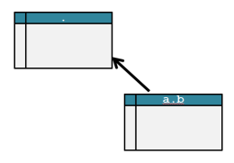
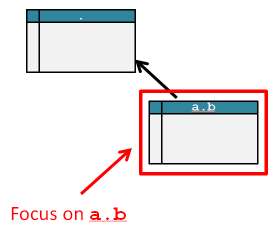
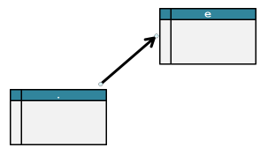
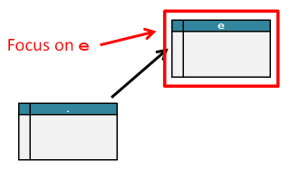
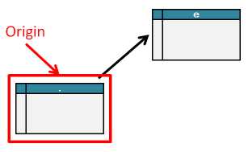

# Column Perspectives in a Snowflake Schema

## Justification

The snowflake concept is an attempt to model the intersection between JSON documents and relational databases. Hopefully, this model will be useful for coding a document-relational map (D-R map) for [jx-sqlite.](https://github.com/mozilla/jx-sqlite)

## Definitions

A snowflake is a set of tables, plus the set of hierarchical foreign relations between them. There is one table that is deemed the key "fact table". Any relational database can have multiple snowflake interpretations; which is likely necessary if we want to cover the whole of a database. There is a lot we can say about covering relational databases, but we will leave that exciting topic for later.  

**Path taken to row is important**

The snowflake assumes the data is denormalized in document form; every fact in the fact table and all its foreign rows, are not shared with any other fact. This assumption is only a conceptual model, an not seriously expected in practice; A database is to be normalized for minimal redundancy. It is important not to talk about any row in a table, but rather the path taken along the foreign relations; starting from the fact to the row in question. 

**Paths to tables**

The path along the foreign keys, from the fact table to any other table, is important. We can not refer to tables by name, rather by path. The snowflake model calls this the `nested_path` of a table. "nested" refers to nested objects found in JSON arrays.

## Perspectives inside a snowflake

We can query any table in the snowflake as if it was a fact table, for clarity we will called this the "origin": Any table in the snowflake can act as the origin of a  perspective; the tables and columns in the snowflake have names relative to the origin.

----------

**Example 1: Nested Objects (one to many)**

The simplest example of perspective is a document with nested objects: 

    [
        {
            "a": {
                "b": [
                    {"x": 1},
                    {"x": 2}
                ],
                "x": 3
            },
            "x": 4
        }
    ]

...and here is the schema the document came from

**Table `.`**

| `_id` |  `x`  |  `a.x`  |
|-------|-------|---------|
|   1   |   4   |    1    |

**Table `a.b`**

| `_id` | `_parent` | `_order` |  `x`  |
|-------|-----------|----------|-------|
|   2   |     1     |     0    |   1   |
|   3   |     1     |     1    |   2   |

There are some important notes:

* The tables are all given relative names: The fact table is named dot (`.`).
* Arrows indicate foreign key relations: The table at the tail of the arrow is assumed to have a property that refers to the table at the head
* The foreign keys are not shown in the document: If the relational database uses foreign keys to only indicate relations, then we can remove those properties without loss of information: The structure is in the JSON document. Sometimes the foreign key is used for business logic, and must be exposed.

Let us use the origin with `nested_path=["a.b", "."]`. Notice the nested path is a list, in the direction of the relation.

Here are the records from that perspective:

    [
        {
            "x": 1
            "..": {
                "a": {
                    "b": [
                        {"x": 1},
                        {"x": 2}
                    ],
                    "x": 3
                },
                "x": 4
            }
        },
        {
            "x": 2
            "..": {
                "a": {
                    "b": [
                        {"x": 1},
                        {"x": 2}
                    ],
                    "x": 3
                },
                "x": 4
            }
        }
    ]

Some liberty was taken here: The `..` property does not actually exist; it is shown to demonstrate the Snowflake schema uses "`..`" in the namespace to refer to the parent document: In other words, you may refer to `..a.x` from the `a.b` origin. 

----------

**Example 2: Reference (many to one)**

A normalized relational database can have foreign keys from the fact table to a lookup table; a many-to-one relation. No JSON document can create such a relation because documents are denormalized entities, but a snowflake schema must be able to interpret all records in its schema as documents. A snowflake will denormalize the schema.

**Table `.`**

| `_id` |  `x`  |  `_e` |
|-------|-------|-------|
|   1   |   3   |   3   |
|   2   |   4   |   3   |

**Table `e`**

| `_id` |  `x`  |
|-------|-------|
|   3   |   1   |

We assume there is only one record in `e`. We include the foreign key `_e` for clarity.

Let us use origin of `nested_path=[".", "_e"]`. Notice the order of the list is in the direction of the relation. 
 
We show that record as JSON:

    {
        "x": 1,
        "..":[
            {"x": 3},
            {"x": 4}
        ]
    }

Again, the "`..`" property does not exist, it is used to demonstrate that you can access the fact table from the perspective of `e` using the snowflake schema's namespace.
 

`nested_path=["."]`

With the origin being our fact table (`.`), we see each of our fact records, along with the `e` property duplicated (denormalized).

    [
        {
            "e": {"x": 1},
            "x": 3
        },
        {
            "e": {"x": 1},
            "x": 4
        }
    ]
  

Mapping from a relational database to a document, and back to a relational database, may not result in the same schema: These two documents will map to a single table:

| `_id` |  `x`  |  `e.x`  |
|-------|-------|---------|
|   1   |   3   |    1    |
|   1   |   4   |    1    |

### File system Metaphor

It may help to use the file system as a metaphor: The tables are directories in that filesystem, The fact table is root (`/`), while the origin table is your current directory (`cwd`). You can refer to any file either in the absolute sense, from root, or in a relative sense, from `cwd`.

## Referring to columns

Given our documents appear different based on the perspective, the columns in the snowflake can go by many aliases. In *Example 1* column `a.b.x` (column `x` in table `a.b`) can be referred to as simply `x` from the `a.b` perspective.  To capture these aliases the `Column.names` dict maps the nested path to the various aliases

	Column(
		names={
			".": "a.b.x", 
			"a.b": "x"
		},
        nested_path=["a.b", "."]
	)

There may be some problems with the `names` attribute:

* We only use the table name, not the whole nested path; we know path is important, which means there are snowflakes that this structure can not hold aliases for. Maybe this problem only shows itself when interpreting relational databases.
* `names` might be functionally dependent on the (`names['.']`, `nested_path[0]`) pair; we may replace it with a `@property` 

